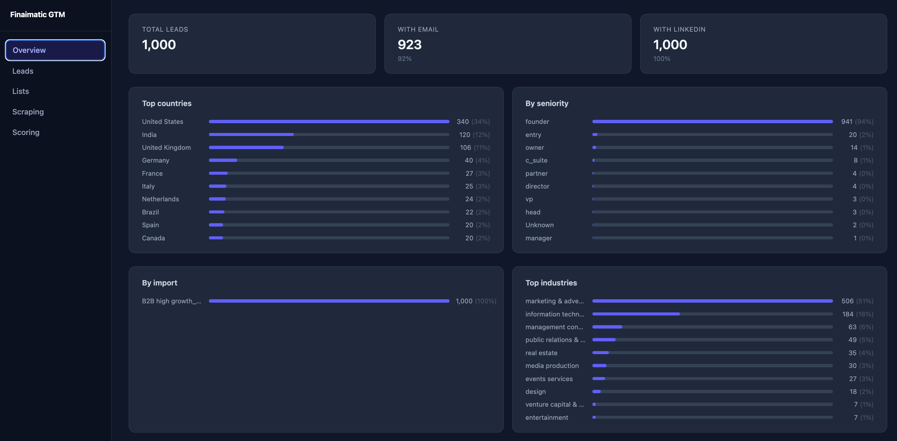
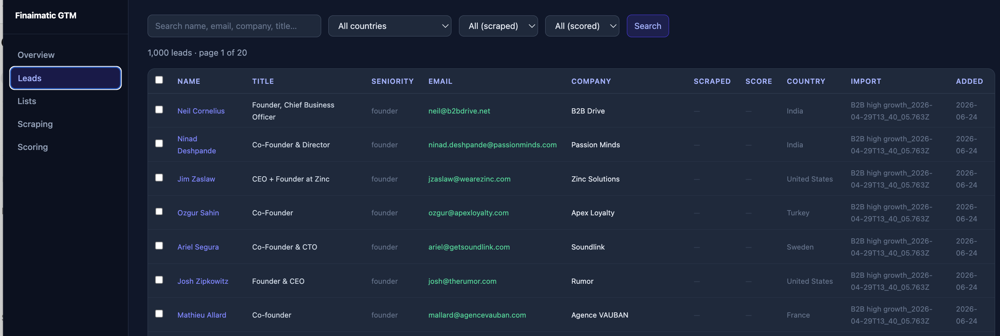
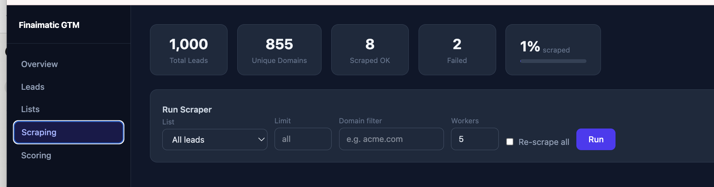
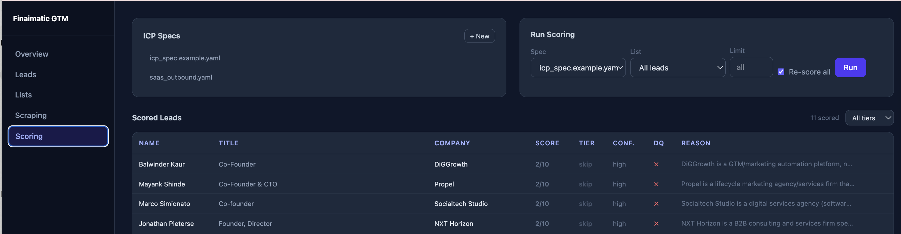

# gtmbackend

SQLite-backed data store for GTM lead management.

## Screenshots






## Setup

```bash
cd framework/gtmbackend
uv sync
uv run migrations/0001_leads.py
```

This creates `gtmbackend.db` in the project directory. To use a different path:

```bash
DATABASE_PATH=/path/to/my.db uv run migrations/0001_leads.py
```

## View database contents

```bash
uv run scripts/show_db.py
```

Shows total leads, breakdown by import batch, country, seniority, industry, and email/LinkedIn coverage. Add `--sample N` to print N example rows:

```bash
uv run scripts/show_db.py --sample 10
```

## Import leads

**From the `leaddata/` folder** (imports all CSVs at once):

```bash
uv run scripts/import_leaddata.py
```

**Single file** from anywhere:

```bash
uv run scripts/import_leads.py "../../leadsexport/B2B high growth_2026-04-29T13_40_05.763Z.csv"
```

Rows are deduplicated on `linkedin_link` — re-running the same file is safe. Override the batch label with `--import-name "My batch"`.

## Score leads (ICP fit)

Scoring runs in three steps: migrate → scrape → score.

**Step 1 — add scoring columns** (one-time):

```bash
uv run migrations/0002_scoring.py
```

**Step 2 — scrape company websites** into `scraped/*.txt`:

```bash
uv run scripts/scrape_leads.py              # all unscraped companies
uv run scripts/scrape_leads.py --limit 100  # cap at 100
uv run scripts/scrape_leads.py --workers 10 # more concurrency
```

**Step 3 — score against an ICP spec**:

```bash
ANTHROPIC_API_KEY=sk-ant-... uv run scripts/score_leads.py --spec specs/icp_spec.example.yaml
ANTHROPIC_API_KEY=sk-ant-... uv run scripts/score_leads.py --spec specs/icp_spec.example.yaml --limit 20
```

Copy `specs/icp_spec.example.yaml` and edit it for your offer before running. Scores are written back to each lead row. A summary report is written to `scoring.txt`.

Scoring columns added: `fit_score` (1–10), `tier` (A/B/C/skip), `confidence` (low/medium/high), `disqualified`, `disqualifier`, `primary_signals`, `value_blockers`, `score_reason`, `scored_at`.

## Generate Apollo export link

Build a People search URL from a structured filter dict:

```bash
uv run scripts/generate_apollo_link.py --filters '{"industries": ["Computer Software"], "seniorities": ["founder", "c_suite"], "locations": ["United States"], "employeeRanges": ["11,50", "51,200"]}'
```

Or describe your ICP in plain English and let `claude-haiku-4-5` extract the filters (requires `ANTHROPIC_API_KEY`):

```bash
ANTHROPIC_API_KEY=sk-ant-... uv run scripts/generate_apollo_link.py --description "B2B SaaS founders in the US with 10-200 employees"
```

The script prints the Apollo URL to stdout and any warnings/extracted filters to stderr.

## Rollback a migration

```bash
uv run migrations/0001_leads.py --rollback
```

## File layout

```
gtmbackend/
  db.py                      SQLite connection helper (get_db context manager)
  pyproject.toml             uv project definition
  uv.lock                    uv lockfile
  gtmbackend.db              SQLite database file (created on first migration)
  leaddata/                  Drop CSVs here to import with import_leaddata.py
  migrations/
    0001_leads.py            Creates leads table
  scripts/
    show_db.py               Print DB summary and stats
    import_leaddata.py       Import all CSVs from leaddata/
    import_leads.py          Import a single CSV from any path
    generate_apollo_link.py  Build Apollo.io People search URL from filters or ICP description
    scrape_leads.py          Fetch company websites → scraped/*.txt
    score_leads.py           Score scraped companies via Surveyor.agent → leads.fit_score/tier
  scraped/                   Auto-created; one .txt file per company website
  specs/
    icp_spec.example.yaml    Example ICP spec for the FB/ad-agency offer
    icp_spec.template.md     Blank template for new offers (see agents/icp_spec.template.md)
  agents/
    surveyor.agent           Surveyor scoring agent (generic, spec-swappable)
    icp_filter.agent         ICP Apollo filter extraction agent
```

## Leads table columns

| Column | Notes |
|---|---|
| `id` | Auto-increment primary key |
| `import_name` | Batch label from the import run |
| `first_name`, `last_name`, `full_name` | |
| `title`, `headline`, `seniority` | |
| `email` | |
| `linkedin_link` | Unique — used for deduplication |
| `is_likely_to_engage` | |
| `lead_city`, `lead_state`, `lead_country` | |
| `company_name`, `industry`, `employee_count` | |
| `departments`, `subdepartments`, `functions` | |
| `company_website`, `company_website_short` | |
| `company_blog_link`, `company_twitter_link`, `company_facebook_link` | |
| `company_linkedin_link`, `company_phone` | |
| `created_at` | Set automatically on insert |
